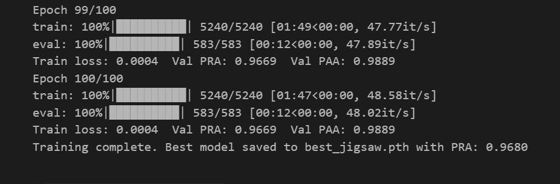
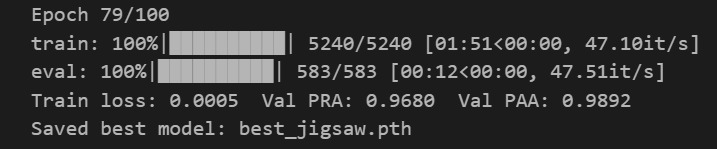
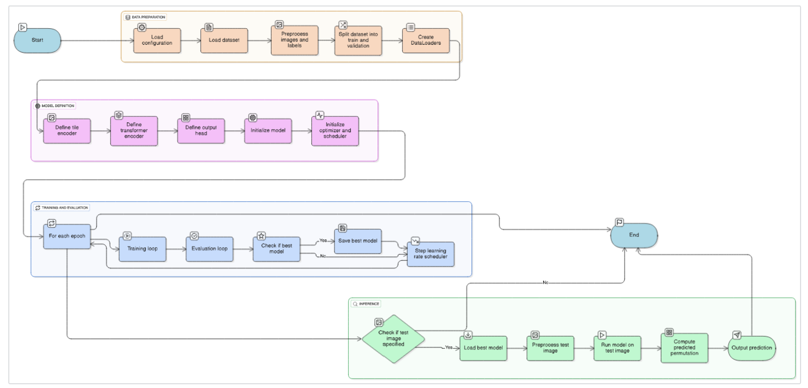
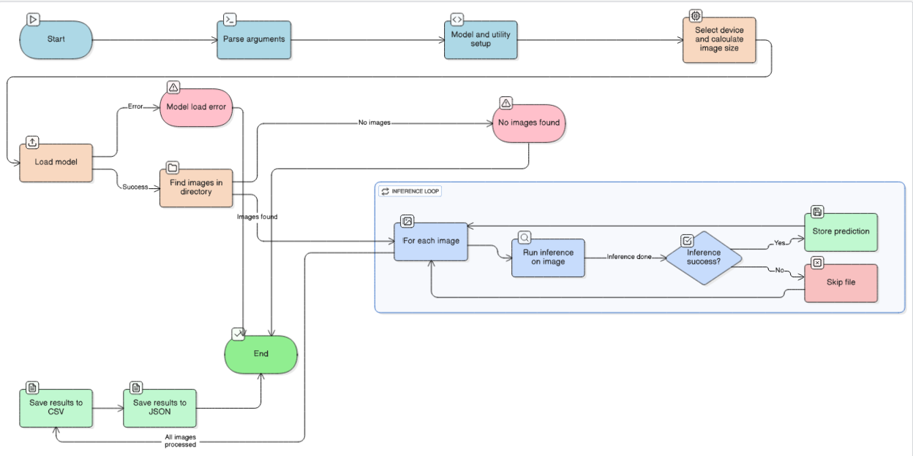
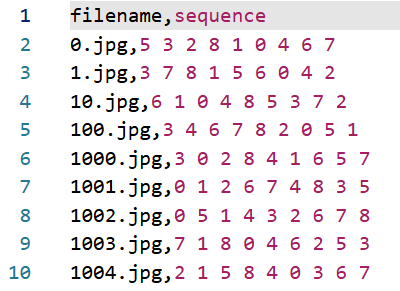
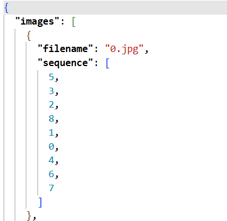

# **Jigsaw Puzzle Solver — Technical Summary**
---

## **Target**


## **[Dataset](https://www.kaggle.com/datasets/shivajbd/jigsawpuzzle)**


---

##  **Technical Accuracy**

* **Training Loss:** `0.0005`
* **Validation PRA:** `0.9680`
* **Validation PAA:** `0.9892`





---

##  **Innovation & Creativity**

###  1. Reframing the Problem

Instead of treating puzzle-solving as a basic classification or regression task, this project **redefines it as a Linear Assignment Problem**, creating a **hybrid fusion** of:

* Deep Learning (for visual understanding)
* Combinatorial Optimization (for perfect piece arrangement)

---

###  2. Hybrid Deep Learning + Optimization System

* **Deep Learning (Score Generator):**
  The **TileTransformer (ResNet-18 + Transformer Encoder)** generates a **9×9 score matrix**, where each element `S(i, j)` denotes how suitable tile `i` is for position `j`.

* **Combinatorial Algorithm (Solver):**
  The **Hungarian algorithm** (`scipy.optimize.linear_sum_assignment`) then computes the **globally optimal assignment**, ensuring each tile is placed correctly without duplication.


---

###  3. Built-in Physical Constraints

* Traditional models often fail by assigning multiple tiles to the same position.
* Here, the **Hungarian algorithm inherently ensures** a valid one-to-one assignment — eliminating invalid configurations and simplifying the model’s learning process.

---

###  4. Context-Aware Relational Modeling

* **ResNet-18** acts as a **local tile encoder** (learns “what” each tile is — corners, edges, texture).
* **Transformer Encoder** models **global relationships** between tiles (learns “how” they relate).
* The **self-attention** mechanism allows the model to ask,
  *“How well does this tile’s edge match that tile’s edge?”*


##  **Methodology**

###  1. Hybrid Context-Aware Architecture

* **Tile Encoder (ResNet-18):** Learns tile-level visual features.
* **Transformer Encoder:** Builds contextual relationships between all 9 tiles using self-attention.
* This combination enables the model to reason about the puzzle as a whole, not just isolated tiles.

---

###  2. Prediction as Linear Assignment

* The model outputs a **9×9 score matrix (S)**.
* Each cell `S(i, j)` represents the probability of tile `i` belonging to position `j`.
* **Hungarian Algorithm** ensures the **optimal one-to-one matching** between tiles and positions.


---

### 3. Training Details

* **Loss Function:** Cross-Entropy Loss
* The model is trained to maximize the correct tile-to-position score.
* This directly prepares the output matrix for the Hungarian solver to find the best valid permutation.

---
## **Workflow**

### Traing Workflow


### Testing Workflow


---


**Step-by-Step Flow:**

1. Split puzzle image into 9 tiles.
2. Extract visual features using **ResNet-18**.
3. Model relationships via **Transformer Encoder**.
4. Generate a **score matrix (9×9)**.
5. Use the **Hungarian Algorithm** to compute the final arrangement.
6. Output predicted tile positions in **CSV and JSON** formats.

---

## **Prediction & Expected Output**

To **predict the puzzle arrangement** for a given image folder:

```bash
python predict.py --image_dir test --model_path final_best_jigsaw.pth --csv_output predict_n.csv --json_output predict_n.json
```

**Expected Outputs:**

* `predict_n.csv` → contains predicted positions for each tile.
* `predict_n.json` → structured JSON output with tile-position mapping.

### CSV Output


### JSON Output

